<div align="center">

# HireRizz

**Your recruiter's got rizz now.**

An AI recruiting assistant: it writes the job post, reads and scores every resume, catches resume fraud,
holds a voice screening call with each shortlisted candidate, scores the interview with evidence, and
emails everyone their result. **People make every decision that matters.**

[Live app](https://hire-rizzz.vercel.app) · [API health](https://hirerizzz.onrender.com/api/health) · [Technical docs](docs/TECHNICAL.md) ·
[Backend README](backend/README.md) · [Frontend README](frontend/README.md)

</div>

---

## Contents

1. [What it does](#what-it-does)
2. [The whole flow, from sign-in to result](#the-whole-flow-from-sign-in-to-result)
3. [How each step works](#how-each-step-works)
4. [Where AI is used (and where it isn't)](#where-ai-is-used-and-where-it-isnt)
5. [Fraud detection](#fraud-detection)
6. [People stay in charge: the two gates](#people-stay-in-charge-the-two-gates)
7. [Emails candidates receive](#emails-candidates-receive)
8. [The dashboard](#the-dashboard)
9. [Tech stack and architecture](#tech-stack-and-architecture)
10. [Repository layout](#repository-layout)
11. [Run it locally](#run-it-locally)
12. [Deploy](#deploy)
13. [Configuration](#configuration)
14. [API reference](#api-reference)
15. [Security and privacy](#security-and-privacy)
16. [Tests](#tests)
17. [Known limits](#known-limits)

---

## What it does

| | |
|---|---|
| 📝 **Job posts in seconds** | A manager writes two sentences; AI drafts the full job description, skills and interview questions, and removes wording that could put off good applicants. One click gives a ready-to-paste **LinkedIn post**. |
| 🗂️ **Many jobs, one board each** | Every posted job has its own board: *Applied → Resume review → Interview → Final review → Selected / Rejected / Fraud stopped*. Click a candidate for everything about them in a side panel. |
| 📄 **Resume reading & scoring** | AI turns each `.docx` / `.pdf` into a structured profile and scores it against the job **without seeing the name, contact details or location**. |
| 🕵️ **Fraud caught early** | Code rules check the timeline and claims, employers are looked up in public records, and an optional LinkedIn PDF is compared with the resume. A red flag stops the candidate before anyone spends time on them. |
| 🎙️ **AI screening call** | Shortlisted candidates get an email with a private link and QR code. They talk to an AI interviewer by **voice or text**, any time, on any device; no account needed. |
| 🧮 **Evidence-based interview score** | AI scores four competencies and must quote the candidate **word for word**; quotes that aren't in the transcript are thrown away. |
| ✅ **Humans decide** | A recruiter approves the resume shortlist; a hiring manager makes the final call. Both can override the AI, and every decision is recorded with who made it. |
| ✉️ **Every email handled** | Invites, reminders, rejections, results and fraud follow-ups go out automatically through Gmail. |
| 📊 **Insights** | The home page shows live numbers, an outcomes donut, how often people agreed with the AI, and rotating "Did you know?" facts. |

---

## The whole flow, from sign-in to result

> GitHub draws this diagram automatically. To edit or export it, paste the code into
> [mermaid.live](https://mermaid.live).
>
> 🟣 Gemini AI · 🔵 code rules · 🟡 people decide · 🟢 email · ⚪ storage / hosting · 🔴 stopped / rejected

```mermaid
flowchart TD
    %% ───────────── HireRizz: end-to-end flow ─────────────

    subgraph S0["🔐 0 · Sign in"]
        A0(["Recruiter / hiring manager opens<br/>hire-rizzz.vercel.app"]) --> A1["Login page<br/>username + password"]
        A1 --> A2{"Credentials OK?"}
        A2 -- no --> A1
        A2 -- yes --> A3["Signed session token<br/>HMAC, valid 7 days<br/>every decision recorded as this user"]
        A3 --> A4["Home dashboard<br/>KPIs · outcome donut · AI-vs-human gauge · Did you know facts"]
    end

    subgraph S1["📝 1 · Post a job"]
        B1["Manager writes a short brief<br/>role, skills, experience, location"] --> B2["JD writer<br/>🤖 Gemini: writes title, description,<br/>skills and 2 role questions,<br/>removes biased wording"]
        B2 --> B3["Manager edits the draft<br/>+ adds / reorders logistics questions"]
        B3 --> B4[("Job saved<br/>MongoDB · jobs")]
        B4 --> B5["LinkedIn-ready post<br/>template, no AI · copy & open LinkedIn"]
    end

    subgraph S2["📥 2 · Resumes in"]
        C1["Upload resumes to the job board<br/>.docx / .pdf"] --> C2["Stage 0 · Ingest<br/>candidate ID + SHA-256 de-duplication per job"]
        C2 --> C3["Stage 1 · Extraction<br/>🤖 Gemini reads the resume into a profile:<br/>name, contact, roles, dates, skills, education"]
    end

    subgraph S3["🕵️ 3 · Fraud & credibility checks"]
        D1["Resume rules<br/>⚙️ inflated experience · skill older than the tech ·<br/>future / overlapping dates · work before graduation"]
        D2["Company existence check<br/>🌐 Wikidata founded / dissolved + website ping"]
        D3["Optional LinkedIn PDF<br/>🤖 Gemini reads it · ⚙️ compared with the resume"]
        D1 --> D4{"Red flags?"}
        D2 --> D4
        D3 --> D4
        D4 -- yes --> D5["🚫 Fraud stopped<br/>no scoring, invite or interview"]
        D5 --> D6["✉️ Email the candidate the mismatches<br/>ask them to fix the resume and reapply"]
        D5 --> D7{"Recruiter reviews:<br/>innocent?"}
        D7 -- "yes: clear with a reason" --> E1
        D7 -- no --> Z2
    end

    subgraph S4["📊 4 · Resume scoring"]
        E1["Stage 2 · Shortlisting<br/>🤖 Gemini scores 4 criteria, name & contact hidden:<br/>must-have 40% · experience 30% · nice-to-have 15% · relevance 15%"]
        E1 --> E2["⚙️ Code computes the weighted score<br/>≥ 70 → AI suggests shortlist, else reject"]
        E2 --> E3{"Gate 1 · Recruiter<br/>Resume review<br/>accept AI or override"}
        E3 -- reject --> E4["✉️ Polite rejection email"]
    end

    subgraph S5["🎙️ 5 · AI screening call"]
        F1["Stage 3 · Invite<br/>private link, expires in 3 days"] --> F2["✉️ Invite email<br/>button + QR code<br/>reminder after 24 h if not started"]
        F2 --> F3["Candidate opens the link<br/>no account needed"]
        F3 --> F4["Interview page<br/>🎤 browser voice: Web Speech recognition + speech synthesis<br/>or text chat"]
        F4 --> F5["AI interviewer<br/>🤖 Gemini agent: consent, asks every question,<br/>max 1 follow-up each, handles opt-out / reschedule"]
        F5 --> F6["Transcript saved"]
        F6 --> F7["🤖 Gemini parses the transcript<br/>notice period, CTC, relocation, answers, red flags"]
        F7 --> F8["Answers stored word for word<br/>per question"]
    end

    subgraph S6["🧮 6 · Interview evaluation"]
        G1["Stage 4 · Evaluation<br/>🤖 Gemini scores competencies with quotes:<br/>role knowledge 35% · problem solving 25% ·<br/>communication 20% · motivation 20%"]
        G1 --> G2["⚙️ Only quotes found word for word are kept<br/>weak evidence / red flags → needs review"]
        G2 --> G3["⚙️ Final score = resume × 0.4 + interview × 0.6<br/>≥ 65 → AI suggests select"]
    end

    subgraph S7["✅ 7 · Final decision & results"]
        H1{"Gate 2 · Hiring manager<br/>Final review<br/>select / reject, can override"}
        H1 -- select --> H2["⭐ Final shortlist"]
        H1 -- reject --> H3["Rejected"]
        H2 --> H4["✉️ Result emails<br/>selected / not selected"]
        H3 --> H4
        H4 --> H5["📄 Results export · CSV"]
    end

    Z2(["Candidate stays stopped"])

    A4 --> B1
    B4 --> C1
    C3 --> D1
    C3 --> D2
    D4 -- no --> E1
    E3 -- shortlist --> F1
    F8 --> G1
    G3 --> H1

    subgraph INFRA["🏗️ Runs on"]
        I1["Frontend<br/>React + Vite on Vercel"]
        I2["Backend API<br/>Python on Render"]
        I3[("MongoDB Atlas<br/>jobs · candidates · records · transcripts · invites")]
        I4["Gmail SMTP<br/>all emails"]
        I5["🤖 Google Gemini<br/>gemini-3-flash-preview → fallbacks:<br/>3.1-flash-lite · 3.5-flash · 3.8-flash<br/>used-up quota is skipped automatically"]
        I1 --- I2
        I2 --- I3
        I2 --- I4
        I2 --- I5
    end

    H5 ~~~ I2

    classDef ai fill:#efe9ff,stroke:#7c3aed,color:#2e1065,stroke-width:1.5px
    classDef rule fill:#e0f2fe,stroke:#0284c7,color:#0c4a6e
    classDef human fill:#fef3c7,stroke:#d97706,color:#78350f,stroke-width:1.5px
    classDef mail fill:#dcfce7,stroke:#16a34a,color:#14532d
    classDef store fill:#f1f5f9,stroke:#64748b,color:#0f172a
    classDef stop fill:#ffe4e6,stroke:#e11d48,color:#881337,stroke-width:1.5px
    classDef good fill:#d1fae5,stroke:#059669,color:#064e3b,stroke-width:1.5px

    class B2,C3,D3,E1,F5,F7,G1,I5 ai
    class C2,D1,D2,E2,G2,G3,B5 rule
    class A1,A2,B1,B3,D7,E3,H1,C1 human
    class D6,E4,F2,H4,I4 mail
    class B4,I3,F6,F8,I1,I2,H5 store
    class D5,Z2,H3 stop
    class H2,A4 good
```



---

## How each step works

### 0 · Sign in
The dashboard has one account. After signing in, the browser holds a signed session token (HMAC-SHA256,
valid 7 days). The backend refuses every dashboard request without it, and **records every decision under
the signed-in account**, whatever the page sends. Candidates never sign in: their private interview link
is their key.

### 1 · Post a job
1. **Post a job** → describe the role in your own words (what they'll do, must-have skills, experience,
   location).
2. The **JD writer** (Gemini) drafts the title, description, must-have and nice-to-have skills, experience
   range and **two role-specific interview questions**, and lists any wording it changed from your brief
   (for example, "young, energetic team" becomes neutral wording).
3. You edit everything, add your own **logistics questions** (notice period, relocation, …), and reorder
   or remove questions. Nothing goes live until you click **Post job**.
4. The job gets its own board, and a **LinkedIn-ready post** opens (emoji, bullets, hashtags, apply link).
   Copy it, or click *Copy & open LinkedIn*.

Jobs can be edited, closed (no new resumes) and reopened.

### 2 · Resumes in (Stages 0–1)
- **Upload resumes** on a job's board (`.docx` / `.pdf`, up to 20 at a time, 10 MB each).
- **Stage 0 · Ingest** gives each file a `candidate_id` (UUID). A SHA-256 hash stops the same resume being
  added to the same job twice.
- **Stage 1 · Extraction**: Gemini turns the resume into a structured profile covering name, contact,
  headline, work history with dates, skills, education, certifications and languages. It's validated
  against a strict schema.

### 3 · Fraud & credibility checks
These run as soon as the resume has been read. See [Fraud detection](#fraud-detection). A **red flag
stops the candidate**: no scoring, no invite, no interview. The candidate is emailed the mismatches and
asked to fix the resume and reapply, and a recruiter can clear the flags with a written reason.

### 4 · Resume scoring (Stage 2) → Gate 1
- Gemini scores four criteria from 0–100, **blind**: the name, email, phone, LinkedIn and location are
  removed from what it sees.

  | Criterion | Weight |
  |---|---|
  | Must-have skills | 40% |
  | Experience vs. the required range | 30% |
  | Nice-to-have skills | 15% |
  | Role relevance | 15% |
- **Code, not the AI**, computes the weighted score and compares it with the pass mark (**70**). The
  result is the AI's *suggestion*.
- **Gate 1:** the recruiter sees the card in *Resume review* and clicks **Shortlist & send invite** or
  **Reject**, or accepts all the AI's suggestions for that column at once.

### 5 · AI screening call (Stage 3)
- Shortlisted candidates get an **invite email** with a button and a **QR code** for a private link
  (expires in 3 days). A **reminder** goes out after 24 hours if they haven't started.
- The link opens the interview page, where the candidate reads what to expect and picks **voice** (the
  browser's own speech recognition and speech synthesis, no paid voice API) or **text chat**.
- The **AI interviewer** (Gemini) asks for consent, then asks every screening question in order. It can
  ask at most one follow-up per question, and handles "I'd rather stop" and "can we do this later?".
  Code controls the structure and the turn limits, so the conversation can't wander off.
- When the call ends, the transcript is saved and **Gemini parses it** into facts: interested, notice
  period, current and expected pay, relocation, availability, the candidate's own questions, red flags and
  a summary. Each answer is also stored **word for word, per question**.

### 6 · Interview evaluation (Stage 4)
- Gemini scores four competencies and must back each one with **verbatim quotes** from the candidate.

  | Competency | Weight |
  |---|---|
  | Role knowledge | 35% |
  | Problem solving | 25% |
  | Communication | 20% |
  | Motivation | 20% |
- Code checks every quote against the transcript and **drops any quote that isn't there word for word**.
  Too little evidence, or red flags, marks the candidate **needs review**.
- **Final score = resume × 0.4 + interview × 0.6**. At **65** or above, the AI suggests *select*.

### 7 · Final decision & results → Gate 2
- **Gate 2:** the hiring manager sees the candidate in *Final review*, with every score, answer and quote,
  and clicks **Select** or **Reject**. They can choose against the AI (for example, select someone below
  the pass mark); the override is recorded.
- **Results** lists the final shortlist, the rejected candidates and anyone still waiting.
  **Email N result(s)** sends *selected* / *not selected* emails, and **Download CSV** exports everything.
  A decision can still be changed afterwards, and the new result can be emailed.

---

## Where AI is used (and where it isn't)

| Step | Gemini's job | Prompt |
|---|---|---|
| Post a job | Draft the job description, skills and 2 role questions; flag biased wording | `backend/prompts/jd_writer/` |
| Stage 1 | Read a resume into a structured profile | `backend/prompts/stage1_extraction/` |
| Credibility (optional) | Read a LinkedIn "Save to PDF" export | `backend/prompts/stage1_extraction/` |
| Stage 2 | Score the resume on 4 criteria (blind) | `backend/prompts/stage2_shortlisting/` |
| Stage 3 | Hold the screening conversation (temperature 0.4) | `backend/prompts/stage3_calling/` |
| Stage 3 | Parse the transcript into facts and answers | `backend/prompts/stage3_calling/` |
| Stage 4 | Score competencies with verbatim quotes | `backend/prompts/stage4_evaluation/` |

**Models:** `gemini-3-flash-preview` first, then `gemini-3.1-flash-lite` → `gemini-3.5-flash` →
`gemini-3.8-flash` (`backend/config/settings.yaml`). Every answer is JSON checked against a strict schema.

- **Busy model (503) or brief rate limit:** retried after 2 s and then 5 s.
- **Model whose quota is used up:** **skipped** for as long as Google says to wait, so there's no delay on
  later calls.
- **Nothing answers:** the candidate is marked *failed* with the reason, and the rest of the batch
  carries on.

**No AI is involved in:** the fraud rules, the company lookup, any score arithmetic or pass mark, the board
columns, the LinkedIn post, the emails, or either decision gate.

---

## Fraud detection

| Check | How | Example of a red flag |
|---|---|---|
| Inflated experience | Total years claimed vs. the sum of the dated roles | Claims 10 years; the roles add up to 4 |
| Skill older than the tech | "N years of X" vs. X's release year (built-in table) | "6 years of Microsoft Fabric" (released 2023) |
| Impossible dates | Future dates, end before start | A role ending in 2030 |
| Overlapping full-time roles | Date ranges of the jobs | Two full-time jobs at once for over a year |
| Work before graduation | Senior roles long before the degree | "Senior Engineer" 5 years before graduating |
| **Company existence** | **Wikidata** lookup (founded / dissolved) + a ping of the company website | Joined OpenAI in 2012; OpenAI was founded in 2015 |
| **LinkedIn cross-check** | Candidate's LinkedIn PDF, read by Gemini and compared field by field | Different employers, titles, or dates more than 3 months apart |

- Flags are **red** (a contradiction), **amber** (worth a question) or **green** (confirmed).
- **One red flag stops the candidate** (`credibility.min_red_to_block`). The candidate automatically gets
  an email listing the mismatches, asking them to fix their resume and **reapply through the job posting**.
  The email includes a *Reapply* button if the job has a public posting link.
- A recruiter can **Clear & continue** with a written reason; the clearance is recorded.
- The checks never reject anyone outright. Before an offer, still verify employment (EPFO/UAN or a
  background check).

---

## People stay in charge: the two gates

| Gate | Who | Sees | Decides | What happens next |
|---|---|---|---|---|
| **1 · Resume review** | Recruiter | Resume score, criterion breakdown, matched and missing skills, AI suggestion | Shortlist / Reject | Shortlist → interview invite · Reject → polite email |
| **2 · Final review** | Hiring manager | Final score, competencies with quotes, every answer, transcript, red flags | Select / Reject | Final lists → result emails when you send them |

Each decision stores **who** decided, **when**, the AI's suggestion at the time, and whether it was an
**override**.

---

## Emails candidates receive

All emails are sent through Gmail SMTP from HTML and text templates in `backend/templates/email/`.

| When | Email |
|---|---|
| Shortlisted at Gate 1 | **Invite**: "Start screening" button + QR code, expiry date, what to expect |
| 24 h later, call not started | **Reminder** |
| Rejected at Gate 1 | **Resume rejected**: polite, no scores |
| Fraud stopped | **Clarification**: the mismatches, and "please fix your resume and reapply" |
| After Gate 2, when you click *Email results* | **Selected** or **Not selected** |

`EMAIL_MODE=outbox` writes the emails to `.eml` files instead of sending them; the tests and dry runs use
it.

---

## The dashboard

- **Home:** a greeting with what's waiting for you; count-up tiles (candidates, open jobs, need review,
  AI interviews, selected, fraud caught); an **outcomes donut** you can hover; the **AI × human agreement**
  gauge; and rotating **Did you know?** facts (hours saved, fraud rate, top fraud signal, median time to a
  decision, average call length, …). Below that, the list of jobs.
- **Job board:** seven columns, search, header stats, and **Accept AI suggestions** on the two review
  columns. Header actions: **Upload resumes**, **Results**, **Job details** (edit, LinkedIn post), and
  **Close job**.
- **Candidate side panel:**
  - **Overview:** decision buttons, scores, progress timeline, decisions and emails, interview link.
  - **Resume:** score breakdown, skills, work history, education.
  - **Interview:** evaluation, every answer, the full transcript.
  - **Credibility:** flags, LinkedIn PDF upload, clarification email, clear fraud.
- **Failures:** anything that failed, with the reason.

---

## Tech stack and architecture

| Layer | Technology |
|---|---|
| Frontend | React 19 + Vite 7, hand-built SVG charts and animation, Plus Jakarta Sans + Space Grotesk (bundled) |
| Candidate interview page | Plain HTML + JS, Web Speech API (speech recognition + speech synthesis) |
| Backend | Python 3.12+ (managed with `uv`), standard-library HTTP server, Pydantic v2 |
| AI | Google Gemini (`google-genai`), JSON output checked against schemas |
| Database | MongoDB Atlas (`pymongo`); a JSON-file store is used for tests and offline runs |
| Email | Gmail SMTP (app password), HTML + text templates, QR codes with `segno` |
| Resume reading | `python-docx`, `pypdf` |
| Public records | Wikidata API (company founded / dissolved / website) |
| Hosting | Vercel (frontend), Render (backend), MongoDB Atlas (data) |

```
Browser ──► Vercel (React app, interview page) ──HTTPS + CORS──► Render (Python API)
                                                                   ├──► Gemini API
                                                                   ├──► MongoDB Atlas
                                                                   ├──► Gmail SMTP
                                                                   └──► Wikidata
```

---

## Repository layout

```
.
├── backend/                      Python API + pipeline (deploys to Render)
│   ├── config/                   settings.yaml (thresholds, weights, models) · default job + questions
│   ├── prompts/                  every Gemini prompt, one folder per stage
│   ├── templates/email/          HTML + text email templates
│   ├── src/screening/
│   │   ├── stage0_ingest.py … stage4_evaluate.py    the pipeline stages
│   │   ├── jobs.py               posted jobs (each with its own questions and candidates)
│   │   ├── credibility.py        fraud rules · company_check.py (Wikidata)
│   │   ├── approvals.py          the two gates, result emails, board columns
│   │   ├── jd_writer.py          AI job-description writer
│   │   ├── insights.py           numbers for the home dashboard
│   │   ├── agent/                AI interviewer, invites, reminders
│   │   ├── llm/                  Gemini client, fallbacks, quota handling
│   │   ├── storage/              MongoDB and JSON-file stores
│   │   └── dashboard/            web server, login (auth.py)
│   └── tests/                    pytest suite (fake AI, file store, outbox email)
├── frontend/                     React + Vite app (deploys to Vercel)
│   ├── src/pages/                Login, Jobs (home + insights), Board
│   ├── src/components/           candidate panel and tabs, charts, logo, dialogs
│   └── public/interview.html     the candidate's interview page
└── render.yaml                   Render blueprint for the backend
```

---

## Run it locally

**Needs:** Python 3.12+ with [uv](https://docs.astral.sh/uv/), Node 20+, a free
[Gemini API key](https://aistudio.google.com/apikey), a Gmail app password, and MongoDB (Atlas or local).

```bash
# 1. backend
cd backend
uv sync
copy .env.example .env          # fill in GEMINI_API_KEY, SMTP_USER, SMTP_PASS, MONGODB_URI
uv run screening check-llm      # checks the key and the model

# 2. frontend (builds into frontend/dist, which the backend serves)
cd ../frontend
npm install
npm run build

# 3. start everything on http://127.0.0.1:8765
cd ../backend
uv run screening serve
```

For live-reloading frontend development, run `npm run dev` (http://localhost:5173, with the API proxied to
port 8765).

**Command line** (`uv run screening <command>`; add `--data-dir <folder>` for a separate data folder,
`--email outbox` for a dry run, or `--storage file` to skip MongoDB):

| Command | What it does |
|---|---|
| `run` | Ingest + stages 1–4 for the default job |
| `ingest` · `extract` · `shortlist` · `call` · `evaluate` | One stage (`--force`, `--only <candidate_id>`) |
| `review` · `approve-shortlist` · `approve-final` | The gates from the terminal |
| `results` · `send-results` | Final lists and result emails |
| `write-jd` · `approve-jd` | The JD writer |
| `check-credibility` | Re-run the fraud checks |
| `simulate-call <candidate_id>` | Talk to the AI interviewer in the terminal |
| `remind` | Send due reminder emails |
| `status` · `check-llm` · `export-schemas` | Utilities |

---

## Deploy

1. **MongoDB Atlas:** create a free cluster and a database user, allow access from `0.0.0.0/0`, and copy
   the `mongodb+srv://…` connection string.
2. **Backend on Render:** New → Blueprint → this repo (`render.yaml`). Fill in the secrets it asks for:
   `GEMINI_API_KEY`, `MONGODB_URI`, `SMTP_USER`, `SMTP_PASS`, `EMAIL_FROM_ADDRESS`. Note the URL.
3. **Frontend on Vercel:** Add New Project → this repo → Root Directory `frontend`. Set
   `HIRERIZZ_API_URL` to the Render URL. `vercel.json` runs `npm run build` and routes `/jobs/…` and
   `/interview/<token>`.
4. **Back on Render:** set `CORS_ORIGINS` and `PUBLIC_BASE_URL` to the Vercel URL (interview links in
   emails point there). Optionally set `DASHBOARD_USERNAME` / `DASHBOARD_PASSWORD` and `SESSION_SECRET`.

Both hosts redeploy automatically on every push to `main`. `GET /api/health` shows the deployed commit.

---

## Configuration

### Main settings (`backend/config/settings.yaml`)

| Setting | Default | Meaning |
|---|---|---|
| `thresholds.shortlist_score` | 70 | Resume pass mark |
| `scoring.weights` | 0.40 / 0.30 / 0.15 / 0.15 | Must-have / experience / nice-to-have / relevance |
| `evaluation.resume_weight` · `interview_weight` | 0.4 · 0.6 | Final score blend |
| `evaluation.final_threshold` | 65 | Final pass mark |
| `evaluation.competency_weights` | 0.35 / 0.25 / 0.20 / 0.20 | Role knowledge / problem solving / communication / motivation |
| `llm.model` · `llm.fallback_models` | see [AI](#where-ai-is-used-and-where-it-isnt) | Gemini models, tried in order |
| `stage3.invite_ttl_days` | 3 | Interview link lifetime |
| `stage3.max_followups_per_question` | 1 | Follow-up questions the AI interviewer may ask |
| `stage3.verify_email` | false | Emailed one-time code before the call |
| `email.reminder_after_hours` | 24 | When to send the reminder |
| `approvals.require_shortlist_approval` | true | Invites only after Gate 1 |
| `credibility.block_on_fraud` · `min_red_to_block` | true · 1 | Stop candidates with red flags |
| `credibility.company_check` | true | Wikidata + website lookup |
| `credibility.email_candidate_on_fraud` | auto | `auto` / `manual` / `off` |

### Environment variables

| Variable | Where | Purpose |
|---|---|---|
| `GEMINI_API_KEY` | backend | Gemini access |
| `MONGODB_URI` · `MONGODB_DB_NAME` | backend | Database |
| `SMTP_HOST` · `SMTP_PORT` · `SMTP_SECURITY` · `SMTP_USER` · `SMTP_PASS` · `EMAIL_FROM_ADDRESS` | backend | Gmail sending |
| `EMAIL_MODE` | backend | `smtp` (default) or `outbox` (write `.eml` files) |
| `PUBLIC_BASE_URL` | backend | Where interview links point (the Vercel URL) |
| `CORS_ORIGINS` | backend | Frontend origins allowed to call the API (`*` patterns allowed) |
| `DASHBOARD_PUBLIC` | backend | `true` = dashboard reachable from the internet (behind the login) |
| `DASHBOARD_USERNAME` · `DASHBOARD_PASSWORD` | backend | Replace the default account (changing them signs everyone out) |
| `SESSION_SECRET` | backend | Key that signs session tokens (optional) |
| `HIRERIZZ_API_URL` | frontend (Vercel) | The backend URL, written into `config.js` at build time |

Secrets live only in `backend/.env` (git-ignored) and in the Render / Vercel settings. **Never commit
them.**

---

## API reference

All dashboard endpoints need `Authorization: Bearer <token>` from `POST /api/login`.

| Method | Path | Purpose |
|---|---|---|
| GET | `/api/health` | Status + deployed commit (public) |
| POST | `/api/login` | `{username, password}` → `{token, user}` |
| GET | `/api/me` | The signed-in user |
| GET | `/api/insights` | Home dashboard numbers |
| GET | `/api/jobs` · `/api/jobs/<id>` | Jobs with board counts · one job with its candidates |
| POST | `/api/jobs` | Post a job, or update one (`job_id`) |
| POST | `/api/jobs/<id>/status` | `open` / `closed` |
| GET | `/api/overview?job=<id>` | Settings + a job's candidates |
| GET | `/api/candidate/<id>` | Everything about one candidate |
| POST | `/api/resumes` | Upload resumes to a job (base64) |
| POST | `/api/approve/shortlist` · `/api/approve/final` | The two gates |
| GET | `/api/results?job=` · `/api/results.csv?job=` | Final lists · CSV |
| POST | `/api/send-results` | Email the results |
| POST | `/api/candidate/<id>/linkedin` | LinkedIn PDF cross-check |
| POST | `/api/candidate/<id>/clear-fraud` · `/request-clarification` | Fraud actions |
| GET/POST | `/api/jd/draft` | Read / create an AI job-description draft |
| GET | `/api/failures` | Processing failures |
| GET/POST | `/api/interview/<token>/info · start · turn · end` | The candidate's interview (the private token is the access) |

---

## Security and privacy

- **Sign-in:** the dashboard needs a login; the server checks a signed token on every request and records
  decisions under that account. Repeated wrong passwords are slowed down.
- **Blind scoring:** the resume scorer never sees names, contact details or location.
- **Interview links:** unguessable tokens that expire, sent only to the address on the resume. Pages send
  no referrer, so the link doesn't leak to other sites.
- **Cross-site protection:** actions need a JSON request from an allowed origin, so a page on another site
  can't make changes.
- **Secrets:** API keys, the database URI and the Gmail password are read from the environment only; logs
  never print credentials.
- **Fraud flags** prompt a human review and an email to the candidate. They never reject anyone
  automatically.

---

## Tests

```bash
cd backend
uv run pytest        # 122 tests
```

The tests use a fake AI, the JSON-file store and outbox email, so they need no API key, database or
network. They cover every stage, both gates, emails, fraud rules, the company check, multiple jobs, the
login, the insights and the Gemini quota handling.

---

## Known limits

- **Gemini free tier:** about 20 requests per model per day. The fallback models extend this, but a busy
  day needs a paid key.
- **Render free tier:** the backend sleeps after 15 idle minutes, so the first request after a pause can
  take up to a minute.
- **Uploaded resume files** are kept on Render's disk, which is wiped on every redeploy. Everything
  extracted from them is safe in MongoDB.
- **Voice interviews** need a browser with speech recognition (Chrome, Edge or Safari). Other browsers use
  text chat.
- **The command line** works on the default job only; the dashboard handles every job.
